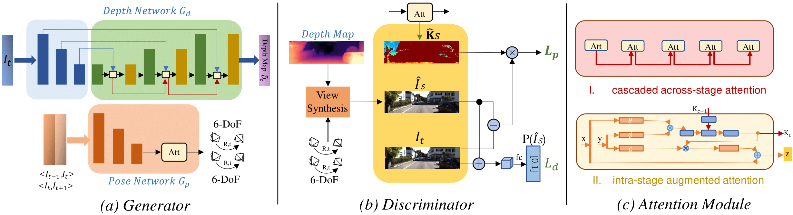
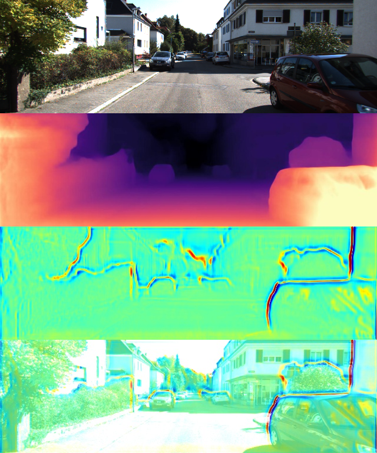

# A Global Occlusion-Aware Approach to Self-Supervised Monocular Visual Odometry

This is the reference PyTorch implementation for the following paper:

* A Global Occlusion-Aware Approach to Self-Supervised Monocular Visual Odometry

## Abstract

Self-Supervised monocular visual odometry (VO) is often cast into a view synthesis problem based on depth and camera pose estimation. One of the key challenges is to accurately and robustly estimate depth with occlusions and moving objects in the scene. Existing methods simply detect and mask out regions of occlusions locally by several convolutional layers, and then perform only partial view synthesis in the rest of the image. However, occlusion and moving object detection is an unsolved problem itself which requires global layout information. Inaccurate detection inevitably results in incorrect depth as well as pose estimation. In this work, instead of locally detecting and masking out occlusions and moving objects, we propose to alleviate their negative effects on monocular VO implicitly but more effectively from two global perspectives. First, a multi-scale non-local attention module, consisting of both intra-stage augmented attention and cascaded across-stage attention, is proposed for robust depth estimation given occlusions, alleviating the impacts of occlusions via global attention modeling. Second, adversarial learning is introduced in view synthesis for monocular VO. Unlike existing methods that use pixel-level losses on the quality of synthesized views, we enforce the synthetic view to be indistinguishable from the real one at the scene-level. Such a global constraint again helps cope with occluded and moving regions. Extensive experiments on the KITTI dataset show that our approach achieves new state-of-the-art in both pose estimation and depth recovery.

## Framework



## Setup

All code was developed and tested on Nvidia TITAN Xp in the following environment.
- python==3.6.6
- pytorch==0.4.1
- torchvision==0.2.1
- tensorboardX==1.4
- opencv==3.3.1
- CUDA==10.0.130

## Dataset
First, download the [Kitti Raw Dataset](http://www.cvlibs.net/datasets/kitti/raw_data.php) and [Kitti Odometry Dataset](http://www.cvlibs.net/datasets/kitti/eval_odometry.php).

And then convert the png images to jpeg using

```bash
find kitti_data/ -name '*.png' | parallel 'convert -quality 92 -sampling-factor 2x2,1x1,1x1 {.}.png {.}.jpg && rm {}'
```

## Training

```bash
python train.py \
    --model_name VOR \
    --width 640 \
    --height 192 \
    --use_attention_depth \
    --use_attention_pose \
    --gc \
    --learning_rate 0.0001 \
    --batch_size 12 \
    --num_epochs 60 \
    --data_path [your data path]
```

## Evaluation

For depth estimation

```bash
python export_gt_depth.py --data_path kitti_data --split eigen
python export_gt_depth.py --data_path kitti_data --split eigen_benchmark
python evaluate_depth.py --load_weights_folder ./your_model_path/models/weights_59/ --eval_mono
```

For visual odometry estimation

```bash
python evaluate_pose.py --eval_split odom_9 --load_weights_folder ./your_model_path/models/weights_59 --data_path kitti_odom/
python evaluate_pose.py --eval_split odom_10 --load_weights_folder ./your_model_path/models/weights_59 --data_path kitti_odom/
```

## Results
From top to bottom: sample image, estimated depth, attention map, overlay of the sample image and attention map.




## Acknowledgement

Some of the codes were borrowed from the excellent works of [monodepth2]((https://github.com/nianticlabs/monodepth2)), [SC-SfMLearner-Release](https://github.com/JiawangBian/SC-SfMLearner-Release)  and [PyTorch-GAN](https://github.com/eriklindernoren/PyTorch-GAN). The borrowed files are licensed under their original license respectively.


